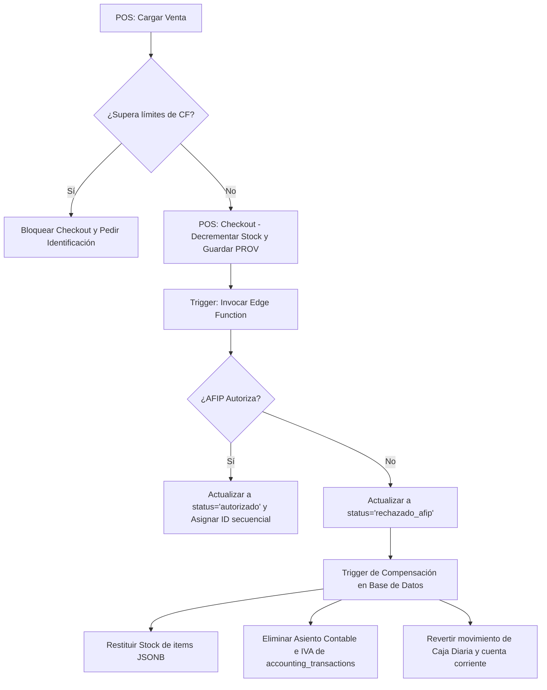

# Propuesta de Cambio: Consistencia Fiscal y Transaccional de AFIP en POS

## 1. Contexto y Problemática

El ERP Nodo Sur permite registrar ventas desde el POS y emitir facturas electrónicas oficiales ante la AFIP/ARCA en homologación de manera asíncrona. Sin embargo, se detectaron dos fallas críticas de consistencia y validación:

1.  **Rechazo Silencioso por Límites de Consumidor Final (RG 4444)**:
    AFIP obliga a identificar al receptor si el monto supera ciertos límites ($191.104 en efectivo, $382.208 por medios electrónicos). El POS actual permite enviar ventas a Consumidor Final (`DocTipo = 99`, `DocNro = 0`) que superen estos montos, resultando en rechazos absolutos (Error 10015) y facturas huérfanas sin CAE.
2.  **Inconsistencia del Estado del Inventario y Asientos Contables**:
    Al confirmar la venta en el POS, el stock se decrementa y los asientos contables/caja se registran **antes** de recibir la autorización de la AFIP. Si la AFIP rechaza el comprobante de forma definitiva o el usuario lo descarta, el stock nunca se devuelve y la contabilidad registra ventas que legalmente no existen, viciando los balances del comercio.
3.  **Inestabilidad de Timeouts en la Edge Function**:
    La comunicación SOAP con AFIP es lenta y propensa a caídas. La Edge Function actual no tiene timeout explícito, lo que causa que se aborte de forma descontrolada por el orquestador de Supabase cuando AFIP no responde, dejando comprobantes colgados en `pendiente_cae` con 0 reintentos.

---

## 2. Solución Propuesta

Para garantizar la integridad técnica y fiscal, se propone una arquitectura de validación y compensación (Saga Pattern a nivel de Base de Datos):

### A. Capa POS (Front-end)
*   **Validación de Límites Preventiva**: Agregar validaciones en `handleCheckout` de [ventas/page.tsx](file:///c:/Users/juanr/OneDrive/Escritorio/Proyectos/Beast-Driven-Development/src/app/protected/%28dashboard%29/ventas/page.tsx) para bloquear el cobro a Consumidor Final si supera los montos de la RG 4444 según el medio de pago seleccionado.
*   **Validación Fiscal**: Validar que "Factura A" requiera obligatoriamente un CUIT de Responsable Inscripto y DNI/CUIT válidos.

### B. Capa de Base de Datos (PostgreSQL)
*   **Trigger Compensatorio Resiliente (`AFTER UPDATE` y `AFTER DELETE`)**:
    *   Si un voucher pasa a `'rechazado_afip'` o se elimina en estado provisional, un trigger del sistema en PostgreSQL leerá de forma atómica el JSONB `items`, incrementará el `stock_actual` de cada repuesto asociado en `articulo` para devolverlo al almacén, y purgará los registros contables, de caja diara y de cuenta corriente asociados a la transacción de venta provisional.

### C. Edge Function (Deno)
*   **Manejo de Timeout SOAP**: Agregar un `AbortController` al fetch SOAP en la Edge Function para abortar limpiamente a los 15 segundos, registrando el estado como `error_temporal` con detalles claros para permitir el reintento del vendedor sin colgar la base de datos.

---

## 3. Matriz de Impacto y Riesgos

| Riesgo Detectado | Impacto | Mitigación Propuesta |
|---|---|---|
| **Diferencias de Redondeo Flotante en IVA**: AFIP rechaza por discrepancia de centavos entre el neto + IVA y el total. | Alto | En el checkout del POS, forzaremos que el neto y el IVA se calculen y sumen redondeados a 2 decimales por cada renglón antes de registrar el total. |
| **Pérdida de Transacciones Contables**: Borrar transacciones de venta puede dejar asientos huérfanos si hay tablas dependientes no declaradas. | Medio | La reversión se realizará por el ID de la transacción contable, borrando primero los registros en `accounting_entries` y luego en `accounting_transactions` para cumplir con las restricciones referenciales. |
| **Timeout de Conexión de Red**: AFIP Homologación caída interrumpe el flujo. | Bajo | La Edge Function manejará el timeout explícito y guardará el comprobante en estado `error_temporal`, permitiendo reintentar desde el POS sin duplicar el stock. |
